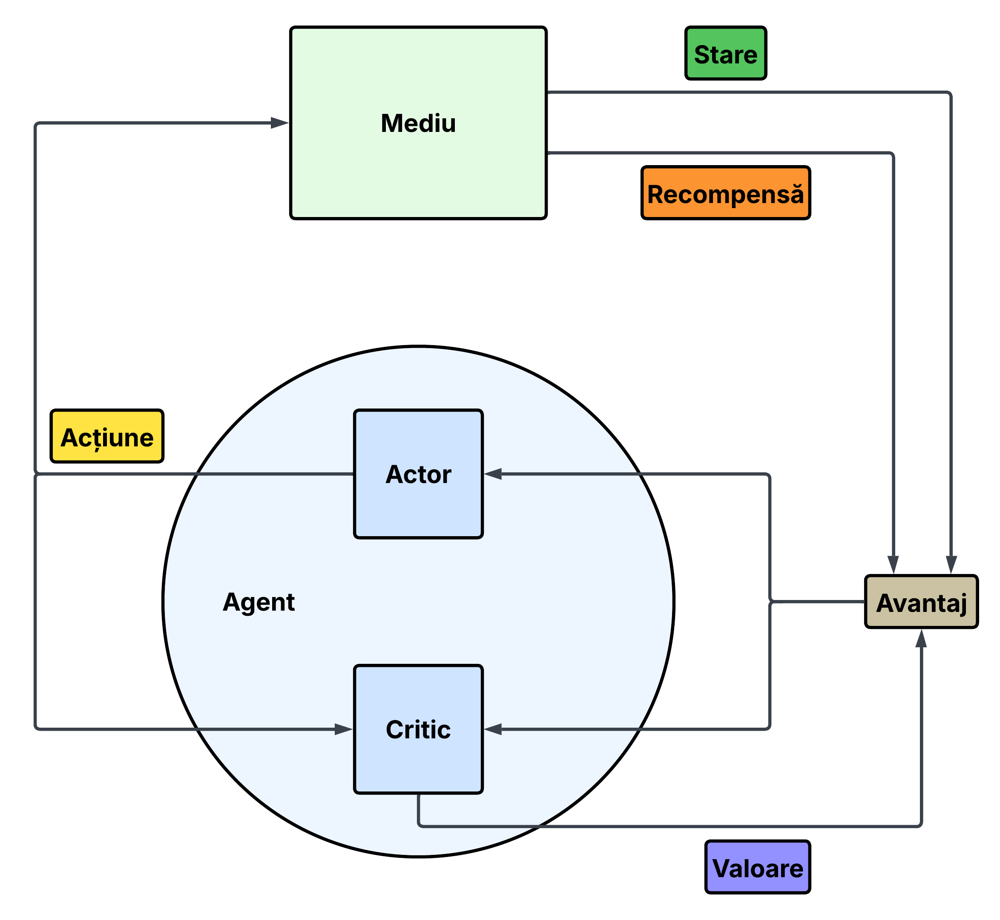
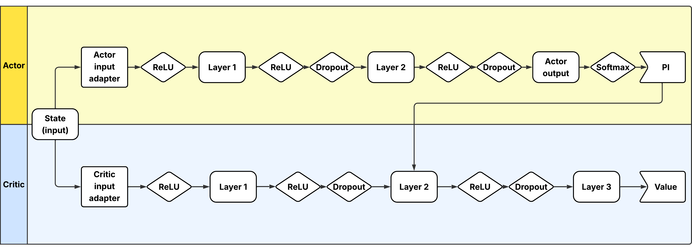
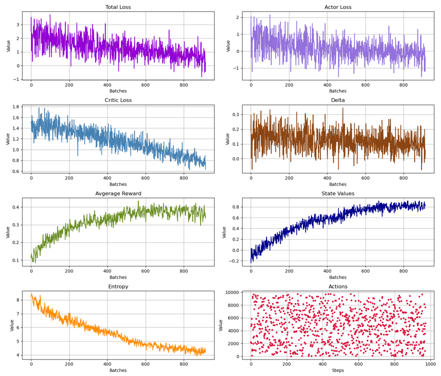

# 🎬 VodRecommender

**VodRecommender** is a movie recommendation system built using the [MovieLens Latest Dataset](https://grouplens.org/datasets/movielens/).  
The project includes several recommendation techniques:

- Collaborative Filtering (SVD-based)
- Content-Based Filtering (Cosine Similarity)
- Hybrid Filtering (Weighted average of both)
- Reinforcement Learning Recommender (Actor-Critic based)

## 🧠 Classic Recommenders

### 1. Collaborative Filtering

📄 File: `src/recommenders/collaborative_filtering.py`
🔧 Library: `surprise` (SVD model)

- Supports training a new model or loading one from a `.pkl` file.
- Main function for getting recommendations:

```python
get_recommendations(
    data: MovieLensData,
    userId: int,
    model,
    recommendationsNum: int = -1
)
```

### 2. Content-Based Filtering

📄 File: `src/recommenders/content_based_filtering.py`  
🔧 Uses: cosine_similarity from `sklearn.metrics.pairwise`

- Creates a user profile from the user's rated movies
- Calculates cosine similarity between user profile and embeddings of unseen movies

```python
get_recommendations(
    data: MovieLensData,
    userId: int=1,
    userProfileFromCSV: str=None,
    recomandationsNum: int=-1,
    showUserRatings: bool=False,
    genresWeights: list=[1],
    yearWeight: float=1,
    ratingsWeights: list=[1,1,1,1,1],
    titleWeight: float=1
)
```

### 3. Hybrid Filtering

📄 File: `src/recommenders/hybrid_filtering.py`

- Combines predictions from both collaborative and content-based filtering
- Uses a weighted average to compute the final recommendation score
- Example usage in `src/example_hybrid_recommender.py`

## 🤖 RL Recommender

### 1. Environment

- **Observation Space**:  
  The user's **profile vector**, built from previously rated movies.

- **Action Space**:  
  The list of **movie IDs**. At each timestep, the **actor network** selects a movie to recommend.

- **Reward Function**:
  - Missing user ratings are filled using the **hybrid recommender** to complete the environment matrix.
  - When the agent selects a movie, it receives the **predicted or actual user rating** scaled to the range `[-1, 1]`.
    - Low ratings → negative reward
    - High ratings → positive reward

### 2. A2C Agent

The agent is trained using **Advantage Actor-Critic**, where the policy (actor) and value function (critic) are updated together.



#### Advantage Function

The temporal-difference (TD) advantage is computed as:

```python
delta = reward + gamma * newStateValue * (1 - int(done)) - currentStateValue
```

And defines losses:

```
actorLoss = -logProbs * delta.detach()
criticLoss = delta ** 2

totalLoss = (actorLoss + criticLoss).mean() - entropyCoef * entropyBonus
```

### 3. Model

The model was originally trained and shared by
[sekharkaredla](https://github.com/sekharkaredla/movie-recommendation-reinforcement-learning/tree/master).
All credits for the original model go to the respective author.

To efficiently process user profiles (observations) and actions, a **shared neural network** (PActorPCritic) is implemented that adapts input/output dimensions for both the Actor and Critic components:

- **Actor Input:**  
  The user profile vector (state observation) is fed into the shared network.

- **Critic Input:**  
  Receives both the state and the chosen action to evaluate the quality of that state-action combination.

- **Shared Network Outputs:**
  - **Policy Distribution (Actor):** The network outputs a probability distribution over possible actions (movies) for the Actor to select from.
  - **State Value (Critic):** The network estimates the value of the current state-action pair, representing how good the action is given the state.



## Training Progress

Below is the training loss, advantage, average reward, state values, actions and entropy evolution over training batches:


